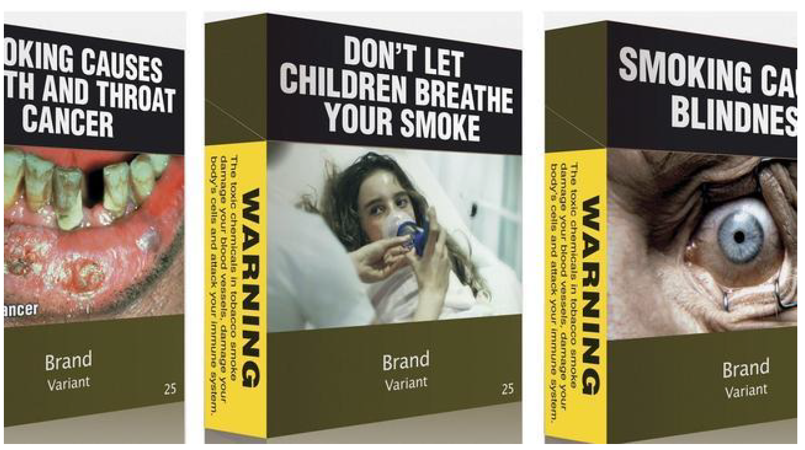

# 1.3 - Decisiones sobre marcas, envases y etiquetas

**Marca:** todo signo o medio que sirva para identificar los productos o servicios de una empresa y diferenciarlos de los de la competencia.

- Palabras y combinaciones de palabras
- Imágenes, figuras, símbolos y gráficos
- Formas tridimensionales (envoltorios, envases, forma del producto y presentación)
- Cualquier combinación de los símbolos mencionados previamente

!!! danger
    No se puede registrar una marca si no se usa. No puedas registrar una marca para bloquear el mercado.

!!! note "Otros"
    Se pueden registrar cosas si se puede trasladar al papel:

    - Se pueden registrar sonidos porque es fácil trasladarlo al papel. *Ej: inicio de Windows*
    - No se pueden registrar olores *todavía* porque no se puede trasladar al papel.
    - Se pueden registrar movimientos.
    - Se pueden registrar colores pero sólo en una categoría de producto. *Ej: milka y su color lila*

!!! example "Formas tridimensionales"
    

!!! danger "Prohibiciones"
    - **Absolutas:** no se pueden registrar como marcas si se componen de signos genéricos (`A`, `rojo`, una bandera de España). Tampoco se pueden registrar nombres contrarios a la ley (organizaciones terroristas).
    - **Relativas:** no se pueden registrar como marcas aquellos que se parezcan a otras marcas ya registradas (fonética, conceptual, etc.).

!!! abstract "Curiosidades"
    - El registro depende del registrador. *Ej: existe el licor de hierbas `Hijo Puta`*
    - Una empresa quiso crear una marca de móviles llamada `pera`. Se denegó porque se parece conceptualmente a `apple`.

    - Se puede registrar el nombre, el nombre con el símbolo y el gráfico por separado. Si no registro el gráfico por separado pero lo registro junto con el nombre, otra marca puede registrarlo con su propio nombre.
    - ¿Se puede usar una marca famosa que ya no se usa? Sí, si no están registradas y no está en ningún proceso judicial.
    - La marca hay que registrarla en los sectores en los que opera y también en los que pretende operar en un futuro.
    - Se debe registrar la marca en todos los países en los que se pretende operar. *Ej: corona se tuvo que cambiar de nombre a coronita en España porque ya estaba registrado*
    - La ley de registros varía de un país para otro.
    - Nombres genéricos como `home` al ser genérico no pueden registrarse, pero sí pueden registrarse junto a un logo (registro mixto).
    - El uso de TM o R no es obligatorio ponerlo en la marca.

## Conceptos básicos de la marca

- **Nombre:** parte que se pronuncia
- **Logotipo:** forma especial que adoptan las letras o grafismo que distingue la marca
- **Eslogan:** aquella parte que se adhiere al nombre y al símbolo. Es el menos estable, puede cambiar a lo largo del tiempo. *Ej: Just do it, de Nike*

## Criterios de elección del nombre de marca

1. **Memorable:** fácil de recordar y memorizar (nombre corto y sonoro)
2. **Significativa:** evocadora del producto / servicio que ofrece. *Ej: telepizza, pedir pizza por teléfono*
3. **Protegible** a nivel legal
4. **Adaptable:** flexible y actualizable
5. **Transferible** a otras categorías de producto y a través de fronteras geográficas. *Ej: la marca de comida para gatos `miau` se tuvo que cambiar por `alpha` en el mercado internacional*

## Estrategia de diferenciación

**Ventajas competitivas:** **bajo coste** (permite bajar el precio final) y **diferenciación** (producto superior, con algún atributo único). Eres mejor si vendes un producto a menor precio o si vendes un producto superior.

Los recursos más críticos que pueden ser una fuente de **ventaja competitiva** serán aquellos:

- Únicos
- ^^Difíciles de imitar^^
- ^^Susceptibles de múltiples usos^^
- No sustituibles
- No sujetos a depreciación
- ^^Relevantes para la toma de decisiones del consumidor^^
- ^^Otro atributo relevante es la **marca**^^

!!! tip "Ventajas competitivas sostenibles"
    Una ventaja competitiva sostenible es aquella que ^^se mantiene en el tiempo^^, es ^^difícil de imitar^^, ^^suceptible de múltiples usos^^, ^^relevantes para la toma de decisiones del consumidor^^ y ^^tener una buena marca^^.

## La marca como fuente de diferenciación

- Crear una marca existe una fuerte inversión.
- Es menos costoso que un fabricante haga un producto y luego otra empresa le pone su marca. *Ej: fabricación en Taiwán*
- **El poder se encuentra en las empresas que tienen una marca reconocida** porque son fácilmente sustituibles por productos más baratos fabricados en otros lugares.

## Capital de marca

**Conjunto de activos y pasivos vinculados a la marca que aumentan o disminuyen el valor aportado por el producto o servicio ofrecido a los clientes.**

A veces es muy relevante. *Ej: cuando Ford compró Jaguar el 16% de su valor eran activos físicos, el resto era capital de marca*

!!! tip "Top of the Mind"
    Se denomina **Top of the Mind** a la marca más conocida dentro de una categoría.

!!! tip "Valor de las marcas"
    [Interbrand](https://interbrand.com/best-global-brands){: .elink} hace una valoración de las marcas.

### Fuentes del capital de marca

El valor de marca se puede monetizar, se puede convertir en beneficios económicos.

¿Qué genera el capital de marca?

1. [**Notoriedad de marca**](#notoriedad-de-marca)
2. [**Imagen de marca**](#identidad-e-imagen-de-marca)

#### Notoriedad de marca

Capacidad de un individuo para identicar, reconocer o recordar una marca como miembro de una categoría de productos. Puede ser **espontánea** o **asistida**. Suele ser mayor la asistida. ^^Crea valor apoyando a otras asociaciones^^, ^^permitiendo la inclusión en el conjunto considerado^^ y ^^a través de la familiaridad[^1]^^.

[^1]: Nos suena la marca y por no buscar compramos su producto.

#### Identidad e Imagen de marca

Distinguir entre **identidad de marca** e **imagen de marca**:

- ^^Identidad de marca^^: es concepto de emisión, procede de la empresa. La empresa marca la identidad.
- ^^Imagen de marca^^: es un concepto de recepción, es lo que interpreta el mercado.

!!! abstract "Otros factores para alterar la percepción de la marca"
    A parte de la identidad de marca, la empresa puede alterar la percepción (imagen) de la marca mediante otros factores:

    - Mimetismo: imitar a la competencia
    - Oportunismo: apuntarse a cualquier tendencia
    - Idealismo: la empresa intenta hacer creer que su producto es el mejor en todos los atributos. Suele ser poco creíble.

A veces no coincide, porque el mercado no interpreta las señales como la empresa pretendía. Puede deberse a la acción de la ^^competencia^^ o a que las señales emitidas por la empresa no eran las mejores.

Los competidores atacan la imagen de los contrarios mediante la **publicidad comparativa**. Conlleva un riesgo muy alto de generar una guerra entre empresas. *Ej: Don Simón atacó a Grannini*

A veces la **publicicdad comparativa** se hace para generar un poco de polémica y hacer que ambas marcas ganen. *Ej: cocacola vs pepsi*

La esencia de la **identidad de marca** se encuentra en la respuesta a estas preguntas:

1. ¿Cuál es su individualidad?
2. ¿Cuáles son sus objetivos a largo plazo?
3. ¿Cuáles son sus valores?
4. ¿Cuáles son sus señas de identidad?

### Beneficios del capital de marca

¿En forma de qué genera beneficios el capital de marca?

1. **Mayor lealtad** (mayor resistencia a las acciones de la competencia).
2. **Mayores márgenes de beneficios** porque se puede fijar un precio más alto y una respuesta inelástica ante la subida del precio
3. **Mayor efectividad comercial** (comunicación y distribución): no tiene que esforzarse en darse a conocer porque los consumidores y proveedores ya conocen la marca.
4. **Oportunidades de licenciar y extender la marca:** ver [licencias](#licencias)
5. **Incrementa el valor de la empresa** y su **capacidad de endeudamiento**.

!!! abstract "Gráfico de lealtad"

    |Compromiso|Repite la compra|No repite la compra|
    |--|--|--|
    |Sí|Lealtad verdadera {: .green}|Lealtad latente|
    |No|Lealtad espúrea o inercia|No lealtad {: .red}|

### Licencias

Una licencia es un **contrato mercantil** por el que el **propietario** de una marca (^^licenciador^^) **permite** que otra empresa (^^licenciatario^^) **identifique** con ella los bienes y servicios que ofrezca. Tiene por objeto la **cesión** del **uso de la marca**. *Ej: ropa cocacola, camisetas disney*

En términos de costes e ingresos licenciar una marca es un muy buen negocio, ya que es firmar el contrato y se reciben los ingresos (mientras se vigila que el contrato se cumple).

## Decisiones de marca

¿Utilizar o no nombre de marca?

- **Sí (producto con marca) [^2]** → Marca propia o de distribuidor?
    - Fabricante:
        - Marca monolítica, [respaldada](#marcas-paraguas-o-marcas-respaldadas) o plural
        - Crear una marca nueva, comprar una marca o extender la marca
    - Distribuidor:
        - Nombre comercial del establecimiento
        - Marca propia distinta del establecimiento
- **No (producto sin marca)**

**Registrar una marca es barato.**

[^2]: Siempre se elige hacer un producto con marca.

### Ventajas de utilizar un nombre de marca

Para el vendedor:

- Ayuda a la **diferenciación**
- Facilita la **gestión interna de pedidos y reclamaciones**
- Facilita la comunicación
- Proporciona una oportunidad para **fidelizar a los clientes**: *si un cliente le gusta mi producto, al tener marca lo podrá encontrar más adelante*.
- Protege al **innovador**: al registrar una patente tienes que decir cómo fabricas el producto y los competidores pueden verlo [^3]. Al ser el primero en registrar la marca se vincula al nuevo producto; aunque surgan competidores mi marca seguirá vinculada al producto.
- Permite la **extensión de la línea y de la marca**
- Añade **valor financiero**

Para el comprador:

- Simplifica el **reconocimiento de los productos**
- **Reduce la incertidumbre en la decisión de compra**
- El **fabricante está identificado** ante el deseo de repetir la compra o de trasladar una queja
- Posee un **valor emocional** que influje en la satisfacción. *Ej: saber que una joya es de Tiffany afecta positivamente la experiencia de uso*.

[^3]: En las farmacéuticas no es importante porque la competencia tarda años en conseguir replicar el procedimiento que hemos patentado.

### Marca monolítica frente a marca plural

**Marca monolítica o única:** se usa la ^^misma marca para todos los productos^^. Se usa cuando los clientes, precios y canales no varíen de una categoría a otra. *Ej: Samsung, Nike, IBM*

- **Mayor notoriedad** y **reconocimiento en el mercado**
- **Ahorro de inversiones en publicidad** y promoción
- **Todos los productos se benefician de la imagen de la marca**
- **Lanzamiento y difusión más rápida**

**Marca plural o múltiple:** se usan ^^diferentes marcas para los diferentes productos^^. Se intenta llevar de forma más eficiente a diferentes segmentos del mercado. *Ej: Henkel (Wipp express, Dixan, Licor del Polo...), Inditex (Zara, Bershka, Pull and Bear, Massimo Dutti)*

- **Contribuyen al desarrollo del mercado:** *si hay muchas marcas en el mercado parece que hay competencia*
- Mejor segmentación del mercado → **gran flexibilidad táctica**
- Limitan las posibilidades de expansión de otros competidores
- **Reducen el riesgo** de que un fracaso afecte a la imagen de la empresa
- Mayor presencia en el lugar de compra
- ^^La mejor forma de no perder consumidores con tendencia a cambiar de marca es ofrecerles varias^^

Arquitectura de marca: marca monolítica / respaldada / plural

### Marcas paraguas o marcas respaldadas

Es una mezcla entre una marca monolítica y una plural.

Son submarcas con identidad propia pero están respadadas por una **marca matriz** que aporta su prestigio y credibilidad.
*Ej: Armani (Giorgio Armani, Emporio Armani, AX), Kellogs (Corn Flakes, Special K), amazon (amazon kindle, amazon echo, amazon fresh, amazon family)*

Requiere una **mayor inversión publicitaria** que una mrca monolítica pero **es capaz de adaptarse mejor a públicos más dispersos**.

### Nueva marca vs extensión de la marca

Al crear una marca nueva:

- ✔️ Puedo moldear la imagen de la marca desde cero
- ❌ Se requieren elevadas inversiones

!!! tip "El nombre de las cosas"
    Hay empresas que se encargan de crear marcas, como la empresa `el nombre de las cosas`, que creó `everis`, `rastreator` y `amena`.

**Extensión de la marca:** la empresa empieza a vender productos de otro sector utilizando la misma marca.

- ✔️ **Obtención de economías de escala** y aprovechamiento de sinergias. {>>No tienes que invertir en crear otra marca <<}
- ✔️ Facilidad para alcanzar una determinada cuota de mercado
- ✔️ Aumento de la eficacia publicitaria
- ❌ Una mala extensión puede generar una actitud negativa hacia la marca entera
- ❌ Disolución de la marca o falta de asociación {>>Por intentar extenderse a demasiados sectores<<}

!!! note "Conclusiones de una extensión de la marca"
    - El éxito de una extensión de marca se ve **favorecido** por una **asociación favorable y una adecuación lógica entre la marca original y la extensión** {>>Que los productos se parezcan algo<<}
    - La calidad ayuda, pero no es una garantía de éxito
    - Una marca prototipo es difícil de extender. *Ej: Kleenex, está demasiado asociado a los pañuelos*
    - Es difícil de extenderse hacia una categoría de producto fácil de hacer. *Ej: Apple haciendo cuadernos, es difícil que cuaje*
    - La estrategia de publicidad más efectiva es aquella en la que se enfatiza la información sobre la extensión.

### Alianzas de marca o cobranding

Estrategia para posicionar marcas desconocidas en nuevos mercados.

Consiste en que dos o más marcas se integran en un mismo producto. *Ej: Mcflurry con M&M, Bacardí con Coca Cola*.

!!! bug "Alianzas raras"
    Milka y queso philadelphia es un ejemplo de un error de alianza.

### Marcas de distrubuidor

Son aquellas marcas que se corresponden con los productos comercalizados bajo el nombre del minorista.

Ventajas para el distribuidor:

- Controla los productos
- Las marcas tienen un precio más bajo

!!! question "¿Es equiparable la calidad?"
    Según la OCU no es un aregla universal.

    A veces las primeras marcas destacan sobre las marcas blancas (*yogures, repostería, huevos, embutidos...*) y en otras las marcas blancas están entre las más valoradas (*verduras congeladas, galletas, cafés, helados, atún embasado...*)

!!! tip "Rebeldes"
    Hay marcas que no fabrican para distribuidores y hacen gala de ello, como *Dodot, Lay's, Listerine o Danone*.

#### Ventajas

- ✔️ Facilita las realciones con la distribución y permite mantener la presencia en el lineal
- ✔️ Permite la consecución de economías de escala
- ✔️ Ofrece la oportunidad de competir en precio con otras marcas de fabricantes y ayudan a eliminar a los pequeños competidores locales
- ✔️ Permite aprovechar la tendencia creciente de las ventas del distribuidor

#### Desventajas

- ❌ Se consigue un incremento de la cuota de mercado a costa de la rentabilidad
- ❌ La marca de distribuidor fabricada puede ser incoherente con la imagen del fabricante
- ❌ Se reduce el atractivo de la categoría
- ❌ Se deteriora el poder de negociación del fabricante
- ❌ El distribuidor dispone de información importante del fabricante

### Alternativas estratégicas de las marcas de fabricante frente a las marcas de distribuidor

- Las marcas de los fabricantes tienen más calidad y más precio.
- Las marcas de los distribuidores tienen menos calidad y menos precio.

¿Qué pueden hacer las marcas de fabricante?

- Innovar en calidad para diferenciarse
- No hacer nada (**sólo en algunas categorías**)
- Crear una segunda marca con un precio y calidad reducidos (parecido a la marca de distribuidor)
    - Se reduce el precio de una marca nueva para conservar las características de la marca existente.
    - :warning: El distribuidor no dejará dejar entrar a una marca de la competencia
- Colaborar con el distribuidor {>>Si no puedes con tu enemigo, únete a él<<}
    - No lo hacen sólo las empresas a las que no las quede más remedio. Los distribuidores buscan fabricantes potentes.
    - Se fabrican los productos sin marca

!!! tip "Grupo AMC"
    Hay fabricantes muy potentes (como el `grupo AMC`) que no utilizan marca, su estrategia se basa en fabricar para los distribuidores.

    Para cerrar los contratos introducen la innovación: *IKEA se compromete a comprar X litros al año si en halloween hacen zumos de calabaza, en verano de gazpacho, etc*

!!! abstract "Marca blanca"
    La marca de distribuidor se denominan `marcas blancas`, ya que en el pasado se comercializaban en un envase con una etiqueta blanca con el nombre del distribuidor (*tomate frito continente*).

### Marcas de distribuidor: del `labelling` al `branding`

- Labelling: marca con el nombre del establecimiento. Se asocia al establecimiento. *Ej: DIA*
- Branding: marca con un nombre distinto al del establecimiento. No se asocia con el establecimiento. *Ej: Sfera (El corte inglés)*

## El envase

Algunos consideran al envase (*packaging*) como la quinta `P`.

Funciones principales:

1. Contener y proteger el producto
2. Identificar y distinguir el producto
3. Favorecer la **diferenciación**
      - Influye en las últimas fases del proceso de decisión de compra
      - Puede tener un coste muy elevado
      - Importante en la estrategia de posicionamiento o reposicionamiento de un producto
4. Atraer la atención
5. Última oportunidad del fabricante

!!! note "Medidas anti diferenciación"
    A veces, el gobierno redacta una ley par que el envase no pueda favorecer la diferenciación del producto.

    *Ejemplo: el tabaco en Australia.*

    

### Decisiones que afectan al diseño del envase

- Envases de uso posterior
- Envases múltiples
- Envases ecológicos
- Cambio de envase

### 🏆 `Reglas de oro del envase perfecto`

Hay reglas técnicas (🧱) y reglas comerciales (🏷️).

- 🧱 **No debe constituir ningín obstáculo para la manipulación y exposición del producto en los estantes**
- 🧱 **Debe facilitar el transporte (ser poco pesado)**
- 🏷️ **El diseño tiene que permitir una rápida identificación**
- 🏷️ **Las formas, materiales y decoración deben comunicar fielmente lo que hay dentro**
- 🏷️ **Debe aportar algún valor añadido al producto**
- 🏷️ **Debe ser respetuoso con el medio ambiente**

## La etiqueta

Es un signo descriptivo adeherido o suejto al envase o producto.

Tiene 3 funciones:

1. **INFORMATIVA**. Incluye en nombre del producto, fabricante, lote, composición, cantidad, caducidad, instrucciones...
2. **FAVORECEDORA DE LA VENTA Y LA GESTIÓN**. Debe hacer que su gestión en los almacenes sea más fácil, como utilizando códigos de barras.
3. **IDENTIFICADORA Y DIFERENCIADORA**. Diseño atractivo que funciona como *vendedor silencioso*.

### Legislación de la etiqueta

Deben estar presentes los alérgenos más importantes (o que más gente padece).

### Código de barras unidimensional

Se suele usar la codificación de 13 dígitos.

- **Código asociado al país** (84 para españa). **Ojo: si el producto tiene el código 84 no quiere decir que sea un producto español o fabricado en España NECESARIAMENTE.**
- **Código de empresa** (5-8 dígitos)
- **Código de producto** (desde el espacio hasta el último número)
- **Código de control** (el último número)

Hay una lista de colores que se pueden usar en los códigos de barras:

Hay otros requisitos relacoinados con el código de barras:

- Dimensiones adecuadas
- Ubicación adecuada
- Calidad de impresión adecuada
- Márgenes amplios

### Etiqueta ecológica de la unión europea

Es un sello que aparece en la etiqueta que distingue al producto y nos informa de que tiene unas determinadas características.

Constituye un **aliciente** para que los **fabricantes** diseñen **productos respetuosos con el medio ambiente**.

Informa a los consumidores de que el **producto es respetuoso con el medio ambiente**.

- Se aprobó por un Reglamento en el Parlamento Europeo en el año 2000.
- Se expide para los países de la Unión Europea y asociados (Noruega, Liechtenstein e Islandia).
- Se aplica a productos (excepto alimentos, bebidas y productos farmacéuticos) y servicios de consumo corriente.

### Gestión de la etiqueta

#### Criterios

Elaboración de criterios (corresponde a la CEEUE):

- Son válidas para un período entre 2 y 5 años, tras el cual serán más restrictivos.
- Se basan en todo el **ciclo de vida del producto**.

??? info "Lista de parámetros"
    - Calidad del aire
    - Protección del suelo
    - Ahorro de energía
    - Prevención del calentamiento global
    - Ruido y biodiversidad
    - Calidad del agua
    - Reducción de residuos
    - Gestión de recursos naturales
    - Protección de la capa de ozono

*[CEEUE]: Comisión de Etiqueta Ecológica de la Unión Europea

#### Solicitud

Cuando se hayan aprobado los criterios ecológicos, el fabricante contacta con el organismo nacional competente y presenta pruebas de que sus productos cumplen los criterios. Rellenan un formulario y abonan entre 300 y 1.300 €.

#### Concesión

Tras aprobarse y concederse la etiqueta, la empresa debe pagar el 0.15% del volumen de ventas con un máximo de 25.000€ por cada categoría de producto. Se pueden aplicar reducciones (*Ej: PYMES*).
