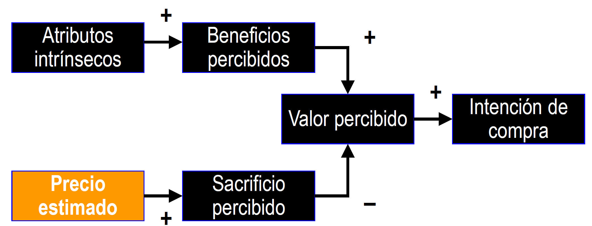

# 2.1. Concepto de precio. El precio como instrumento de marketing

## El precio en la economía

**El precio es un dato impuesto por el mercado**. ^^Surge de la intersección entre las curvas de oferta y demanda, no puede ser modificado por un individuo^^.

Asumimos un modelo de competencia perfecta:

- Productos homogéneos
- Información completa
- Consumidor racional

!!! bug "Competencia perfecta: un modelo que desmiente la realidad"
    - Productos diferenciados
    - Mercados no transparentes
    - Consumidor limitadamente racional

## El precio como herramienta comercial

Buscamos la diferenciación de nuestro producto. El precio es una variable comercial clave para el éxito.

- **Instrumento de estímulo de la demanda** con gran influencia en la cuota de mercado, beneficios y rentabilidad.
- Uno de los **elementos más flexibles del mix de marketing**. Es un **arma competitiva poderosa** que se puede emplear con relativa **facilidad y rapidez**.
- **Único instrumento que genera ingresos**. Las restantes variables suponen un gasto.
- Juega un papel relevante en el **posicionamiento y diferenciación del producto**.

## Distintas denominaciones del precio

Al precio se le llama de distinta forma según el contexto:

- **Precio** → bienes de consumos e industriales
- **Honorarios** → servicios profesionales, como médicos y abogados
- **Alquiler/renta** → utilización de inmuebles o equipos durante un tiempo específico
- **Prima** → seguros
- **Tarifa** → energía eléctrica, agua, teléfono
- **Tasa** → servicio público
- **Jornal** → trabajo de un día

## Conceptos de precio

### Concepto tradicional de precio

Cantidad de dinero que se precisa para adquirir una determinada cantidad de un bien o servicio.

$Precio=\dfrac{cantidad\; de\; dinero\; intercambiado}{cantidad\; de\; producto\; intercambiado}$

Es una definición muy limitada, ya que no tiene en cuenta:

- El **sacrificio total** del consumidor **es más que el dinero que entrega** (*tiempo, molestias*)
- **Lo que se recibe** a cambio de algo **es algo más que una determinada cantidad de producto**

### Concepto ampliado de precio

Es el **conjunto de esfuerzos y sacrificios** (^^monetarios y no monetarios^^) que **un consumidor debe realizar** como **contrapartida** a la **obtención de un determinado nivel de utilidad**. Dicho nivel de utilidad ^^depende de la cantidad y calidad de aquello que el consumidor recibe del vendedor^^.

$Precio=\dfrac{esfuerzo\; o\; sacrificio\; total\; del\; consumidor}{utilidad\; o\; satisfacción\; total\; recibida}$

El precio tiene una **naturaleza compleja y multidimensional**

## Posibles formas de modificar el precio de un producto

Podemos modificar el precio de un producto a través de sus componentes (*sacrificio del consumidor* o *satisfacción recibida*)

==Esfuerzo o sacrificio del consumidor==

- Variar la **cantidad de dinero exigida** a cambio de una determinada cantidad y calidad del producto
- Aplicación o eliminación de **descuentos**. *Ej: rappels*
- Cambiar momento, lugar o modalidad de pago.

==Utilidad o satisfacción recibida==

- Modificar la **cantidad de producto recibida** por el mismo dinero
- Modificar la **calidad de producto**
- Concesión de **regalos**
- Añadir (o dejar de prestar) **servicios adicionales**: transporte, instalación y montaje, reducción del plazo de entrega, etc.

## El papel del precio en el proceso de decisión de compra

Desde la ^^perspectiva del marketing^^, el proceso de compra del consumidor puede ser analizado como un **sistema de intercambio de beneficios o satisfacciones por sacrificios monetarios y no monetarios**.

!!! tip "Definimos valor percibido como..."
    *Evaluación global del producto basada en la estimación de lo que el consumidor espera recibir a cambio de lo que sacrifica.*

    $Valor\; percibido = \dfrac{Beneficios\; percibidos}{Sacrificio\; percibido}$

**La elección del consumidor recaerá sobre aquel producto con mejor relación beneficio-sacrificio** (**calidad-precio**)

## Definición y ejemplo de atributos intrínsecos y extrínsecos

!!! warning "Orden"
    En las transparencias aparecen los modelos [normativo](#el-modelo-normativo) y [positivo](#el-modelo-positivo) antes que este apartado, pero el profesor considera mejor este orden.

**Atributos intrínsecos**: tienen un carácter formativo, generan utilidades o ventajas buscadas en el producto.

- *Ej: automóvil → potencia, seguirdad, consumo, diseño, prestaciones...*

**Atributos extrínsecos o variables de imagen** (distintos al precio): tienen un carácter reflectivo, son atributos de los cuales los consumidores suelen extraer información acerca de la calidad (aunque no se consideran determinantes de la calidad). {>> No van a generar utilidades ni satisfacción, pero su presencia puede ser interpretada como señal de calidad <<}

- *Ej: automóvil → marca, fabricante, país de origen...* {>> Puedo creer que un BMW tiene calidad por ser famoso, pero puede tener el motor de un 600 <<}

## Modelos

### El modelo normativo

### El modelo positivo

Considera que el precio puede ser un atributo extrínseco (**efecto dual del precio sobre el valor**), puede afectar a la imagen del producto. Se comporta igual que la marca. {>>Aunque un vino cueste 100 nada me garantiza que sea bueno<<}
