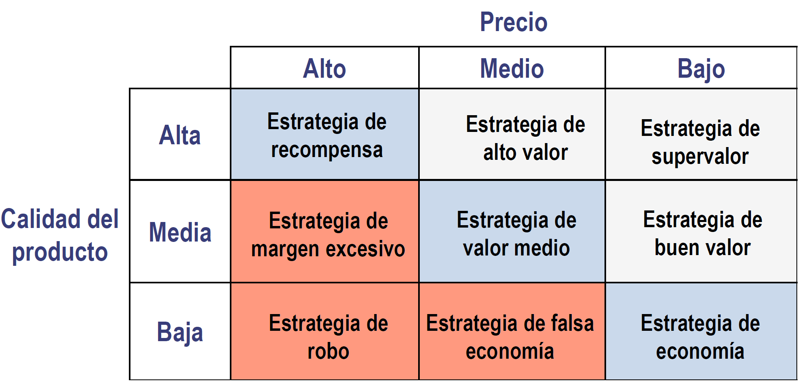

# 2.3. Métodos de fijación y tácticas de precios

El proceso de fijación de precios no se limita a la aplicación de una técnica.

Es un proceso continuo que se inicia con el **establecimiento de unos objetivos generales** en la empresa, pasa por la **aplicación de un procedimiento para su cálculo** y se **extiende más allá del momento en el que se ha determinado el precio**.

## Proceso de fijación de precios

La secuencia de etapas revela:

- La fijación del precio está subordinada a los objetivos de la empresa y a la estrategia de marketing
- Hay que revisar el precio viendo si se han cumplido o no los objetivos propuestos
- Importancia de ^^costes^^, ^^demanda^^ y ^^competencia^^ como condicionantes básicos

### Métodos de fijación de precios

Según el factor en el que se ponga el énfasis:

1. [**Basados en costes**](#métodos-basados-en-los-costes-o-de-precios-internos)
    - Precio límites
    - Precio técnico
    - Precio objetivo
2. [**Basados en la competencia**](#métodos-basados-en-la-competencia)
    - Fijación de precios al nivel corriente
    - Fijación de precios al nivel marcado por el líder
    - Fijación de precios en función del posicionamiento competitivo
    - Licitación o concurso
    - Método del valor percibido
    {: .magenta}
3. **Basados en la demanda**
    - Método del valor percibido
    {: .magenta}
    - Análisis de estabilidad
    - Banda de precios aceptable

**Los métodos no son excluyentes.**

El precio más bajo lo fija el coste del producto y el precio más alto lo fija la demanda (lo que están dispuestos a pagar los consumidores).

Podemos definir el precio en este rango, pero **la competencia condiciona fuertemente la fijación del precio**.

## Métodos basados en los costes (o de precios internos)

- **Precio límite:** permite recuperar el coste variable unitario. **No recupera costes fijos.**
- **Precio técnico:** permite recuperar el coste variable y una parte proporcional de los costes fijos.
- **Precio objetivo:** permite obtener un cierto beneficio.

|Precio|Explicación|Fórmula|
|--|--|--|
|Precio límite|coste variable unitario|$P=c$|
|Precio técnico|coste variable unitario + costes fijos / nivel de actividad|$P=c+CF/Q$|
|Precio objetivo|precio técnico + margen|$P=P_T+margen$|

### Umbral de rentabilidad o punto muerto

El punto muerto se alcanza cuando para una cantidad de productos fabricados los ingresos totales son iguales a los costes. Las ventas por debajo de este precio suponen pérdidas.

**A cada precio de venta corresponde un punto de equilibrio.**
{: .tail}

!!! danger "Suposiciones y limitaciones"
    - ✔️ Los costes fijos son constantes (válido para el corto plazo)
    - ❌ Los costes variables son constantes con respecto a la producción  (no válido)
    - ❌ Incapacidad para determinar si es posible vender esa cantidad

## Métodos basados en la competencia

- **Fijación de precios al nivel corriente:** precio similar al precio medio de los productos de la competencia
- **Fijación de precios al nivel marcado por el líder:** mercados oligopolístocs y con poca diferenciación, donde existe un líder claro
- **Fijación de precios en función del posicionamiento competitivo**
    - Precios elevados
    - Precios bajos
- **Caso particular: [licitación o concurso](#licitación-o-concurso):** adjudicaciones públicas para conseguir un contrato

### Licitación o concurso

Gana el concurso la empresa que fije el mejor precio siempre que se cumplan las condiciones estipuladas.

Método del valor esperado {>>ofrece un apoyo a la decisión de fijación del precio para empresas que optan a muchos recursos<<}

^^En el cálculo de $p$ reside la dificultad de la fijación de precios para una licitación. La experiencia del responsable de la fijación de precios en licitaciones pasadas determinará un mejor ajuste de esta probabilidad.^^

### Análisis de la elasticidad

Factores condicionantes:

- Originalidad y grado de diferenciación del producto (*inelástica*)
- Existencia de productos sustituibles (*elástica*)
- Posibilidad de comparar los productos en términos de calidad
- Importancia relativa del gasto
- Precio efectivamente pagado por el comprador respecto al coste total
- Carácter complementario del producto respecto a otro previamente adquirido
- Efecto de la relación precio-calidad percibida
- Posibilidad de almacenamiento del producto
- Existencia de precios de referencia

### Método de la banda de precios aceptable

El consumidor mentalmente establece un rango de precios en los que compraría el producto. Fuera de ese intervalo no compraría el producto.

Si es demasiado bajo sospecha que la calidad es tan baja que ni siquiera compensa el bajo precio.

!!! example "Ejemplo práctico"
    
    Podemos ver que el precio para el cual el 50% considera el precio demasiado bajo está entre 4.000 y 6.000; y el precio para el cual el 50% de la gente considera el precio demasiado alto está entre 10.000 y 12.000. **Estamos usando la mediana.**

    Banda de precios aceptable: cogemos la media, límite inferior 5.000 y límite superior 11.000 → `[5.000, 11.000]`

    El mejor precio es 8.000

### Fijación de la banda de precios aceptable

## Método del valor percibido

Parte de ^^reconocer a la competencia^^ y de la ^^importancia que el consumidor le da al valor del producto^^.

Con este método calcularemos el límite superior del precio. El consumidor está dispuesto a pagar como máximo el valor que asigna a la utilidad que le aporta el producto.

!!! example
    

    **Pregunta: estimar el nivel de precio que hace que la marca D tenga la mejor relación calidad-precio recibida**

    $VPD \geq VPB$

    $12.480/PRD \geq 1,086$

    $PRD \leq 12.480/1,086=11.491,70$

    Con `11.491,70` la calidad-precio de D será igual que la de B. Para que sea mejor, el precio de D tendrá que ser menor que `11.491,70`.

    Abreviaturas:

    - **VPB** = Valor Percibido B
    - **VPD** = Valor Percibido D
    - **PRD** = Precio Real D

**Etapas:**

1. Evaluación de los consumidores de la calidad percibida en una marca
2. Índice de calidad relativa
3. Precio ajustado a la calidad

Según el rango:

- Si $Valor\; Percibido < 1 \rightarrow$ ❌ **mala** relación calidad-precio
- Si $Valor\; Percibido = 1 \rightarrow$ 💠 relación calidad-precio **aceptable**
- Si $Valor\; Percibido > 1 \rightarrow$ ✔️ **buena** relación calidad-precio

## Estrategias precio y calidad

- Las estrategias más adecuadas son las de la diagonal principal de la matriz.
- Por encima de la diagonal principal atacamos las estrategias de la diagonal
- Por debajo de la diagonal principal estamos ante un sobreprecio sobre la calidad. Debe ser evitado

## Tácticas sobre precios

### Precios psicológicos

El precio tiene un **factor psicológico**:

- Los consumidores retienen principalmente los primeros dígitos. *Ej: 499 se percibe como bastante inferior a 500, pero 493 no se percibe como tan inferior a 494*.
- Los precios con menos dígitos se perciben como menores. *Ej: 950 frente a 935 comparado con 1010 frente a 995*.
- **Estrategia de utilización de precios de referncia internos:** los consumidores tienen a comprar un precio intermedio, ni muy alto ni muy bajo.
- **Respuestas asimétricas al precio:** los consumidores perciben de manera distinta las ganancias y pérdidas de igual magnitud. Suelen Preferir la alternativa en la que perciben una reducción de precio

### Adaptaciones del precio

### Precios promocionales

### Discriminación de precios

### Precios para un conjunto de productos
