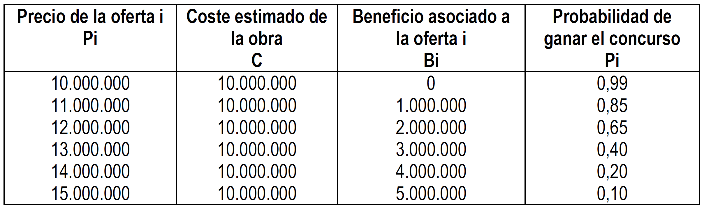

# Problemas tema 2

## `Problema 1`

Una pequeña empresa dedicada a la producción de cordones de diseño para zapatos y zapatillas ha estimado que el coste variable es de $20$ u.m. por unidad. Estudios empíricos realizados han estimado que la demanda anual tiene la siguiente ecuación ($Q$ representa a la demanda y $p$ al precio): $Q = 196.000- 360p$. El director de marketing necesita saber que precio permite maximizar el beneficio anual, si el coste fijo anual es de $200.000$ u.m. **Determine el umbral de rentabilidad para esta empresa.**

Datos:

- $CV_U=20$
- $Q=196.000-360p$
- $CF=200.000$

$BAII=Qp-CV\cdot Q-CF=(196.000-360p)p-20(196.000-360p)-200.000$

$BAII=-360p^2+203.200p-4.120.000$

Beneficio máximo: $\dfrac{dBAII}{dp}=-720p+203.200=0→p=282,2$

Umbral de rentabilidad: $Qp=Q\cdot CV+CF→Q=\dfrac{CF}{p}-CF_U=\dfrac{200.000}{282.2}-20=762,7$

**No calcular el umbral de rentabilidad directamente resolviendo la ecuación con la calculadora, sale mal.**
{.red}

## `Problema 2`

La empresa PIP desea fijar los precios de sus productos basándose en el coste. Se sabe que los costes fijos totales de la empresa ascienden a $3.000.000$ u.m., la producción y demanda es de $5.000$ unidades, el coste unitario variable es de $1.000$ u.m. Con esta información, **calcule el precio límite**, **el precio técnico** y **el precio objetivo** si la empresa desea obtener un beneficio por unidad de $1.000$ u.m. **¿Con qué precio conseguiría la empresa maximizar los ingresos totales?** **¿Con que precio conseguirá maximizar el beneficio?** La función de demanda de la empresa respecto al precio es la siguiente: $Q=2.700-p$ (siendo $Q$=demanda y $p$=precio).

Datos:

- $CV_U=1.000$
- $Q=5.000$
- $CF=3.000.000$
- $Q=2.700-p$

### 1. Precios

- **Precio límite:** $1.000$
- **Precio técnico:** $1.000+\dfrac{3.000.000}{5.000}=1.600$
- **Precio objetivo:** $2.600$

### 2. Maximización de ingresos

$I=(2.700-p)p=2.700p-p^2$

$\dfrac{dI}{dp}=2.700-2p=0→p=1.350$

### 3. Maximización de beneficios

$BAII=(2.700-p)p-1.000(2.700-p)-3.000.000$

$BAII=-p^2+3.700p-5.700.000$

$\dfrac{dBAII}{dp}=-2p+3.700=0→p=1.850$

## `Problema 3`

Una empresa desea determinar el precio de venta de sus dos variedades de cervezas, con y sin alcohol, denominadas `CON` y `SIN`, respectivamente. Esta empresa produce $60.000$ litros de `CON` y $80.000$ de `SIN`. La empresa tiene unos costes fijos anuales de $4.000.000$ u.m. y los costes variables unitarios son de $100$ u.m. para la `CON` y $90$ u.m. para la `SIN`. Determinar el precio de venta si el objetivo perseguido por la empresa es obtener un margen de beneficio unitario sobre el precio de coste del 20% para la `CON` y del 15% para la `SIN`. Distribuya los costes fijos utilizando la proporción que corresponde a cada producto sobre el total de costes variables.

Calculamos la proporción de costes fijos de `CON`:

$CON_\%=\dfrac{60.000\cdot100}{60.000\cdot100+80.000\cdot90}=45,45\%$

|Cerveza|%|CF|CV|CT|CT/Q|
|--|--|--|--|--|--|
|`CON`|45.45%|1.820.000|6.000.000|7.820.000|130,33|
|`SIN`|54.54$|2.180.000|7.200.000|9.380.000|117,25|

$P_{CON}=1.2\cdot130,33=156,39$ 
$P_{SIN}=1.2\cdot117,25=134.83$

## `Problema 4`

Con los datos siguientes, capital invertido = $150.000$ u.m., tasa de rentabilidad = 15% sobre el capital invertido, coste variable unitario = $8$ u.m. y coste fijo del período = $45.000$ u.m., determine los precios internos (límite, técnico y objetivo) para los diferentes supuestos sobre el nivel de actividad.

- Hipótesis pesimista: $500$ unidades
- Hipótesis más probable: $750$ unidades
- Hipótesis optimista: $1000$ unidades

$BAII=150.000\cdot 15\%=22.500$

|Nivel de actividad|CF|CV|CT|BAII|Ingresos|
|--|--|--|--|--|--|
|500|45.000|4.000|49.000|22.500|71.500|
|750|45.000|6.000|51.000|22.500|73.500|
|1.000|45.000|8.000|53.000|22.500|75.500|

$Margen_\%=BAII/Q$

|Nivel de actividad|Precio límite|Precio técnico|Precio objetivo|
|--|--|--|--|
|500|8|$8+45.000/500=98$|143|
|750|8|$8+45.000/750=68$|98|
|1.000|8|$8+45.000/1.000=53$|75,5|

## `Problema 5`

Una empresa acude a un concurso para realizar una obra cuyo coste se estima en diez millones. La probabilidad de conseguir el contrato varía entre un máximo de $0,99$, para un precio de $10.000.000$, y un mínimo de $0,10$ para un precio de $15.000.000$. El resto de probabilidades se muestran en la tabla siguiente.

**Determine que oferta reporta a la empresa un mayor beneficio esperado y qué beneficio real obtendría si consigue que le adjudiquen el concurso.**

Añadimos una columna a la tabla (`Beneficio esperado = Beneficio * Probabilidad`):

|Precio de la oferta|Beneficio esperado =  Beneficio \* Probabilidad|
|--|--:|
|10.000.000|0|
|11.000.000|850.000|
|12.000.000|**1.300.000**{.green}|
|13.000.000|1.200.000|
|14.000.000|800.000|
|15.000.000|500.000|

La mejor oferta es la que más beneficio esperado nos da: $12.000.000$ 
El beneficio real es el beneficoi de la propia oferta: $2.000.000$

## `Problema 6`

Una empresa fabricante de maquinaria herramienta para el cuidado de jardines ha sido invitada a participar en un concurso público organizado por la Unión Europea. La empresa sabe que junto con ella ha sido también invitada la empresa competidora, Rentamax. Después de un estudio cuidadoso de las bases, prepara tres planes alternativos de oferta que podría presentar, con tres niveles de precios que le proporcionan, obviamente, diferentes beneficios. Gracias a otras licitaciones pasadas, la empresa puede determinar la probabilidad que tendría de ganar el concurso si presentara cada uno de los precios seleccionados, que se incluyen a continuación junto con los probables beneficios. ¿Qué plan de los tres deberá presentar?

||Precio de la oferta|Beneficio|Probabilidad de ganar|Ben. Esp.|
|--|:--:|:--:|:--:|:--:|
|Plan A|7.000|1.000|0,90|900|
|Plan B|8.000|2.000|0,75|1.500|
|Plan C|10.000|4.000|0,25|1.000|

La mejor opción es el plan B (tiene un mayor beneficio esperado). El beneficio real sería $2.000$
