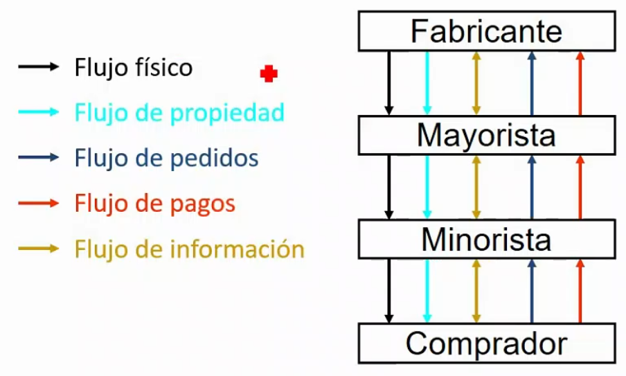

# 3.1. La distribución comercial y los canales de distribución

**Objetivo:** hacer pasar los bienes y servicios terminados del estado de producción al estado de consumo.

^^Función de la distribución dentro del sistema económico^^: reducir las disparidades entre oferta y demanda → [valor añadido de la distribución](#valor-añadido-de-la-distribución)

## Valor añadido de la distribución

1. ^^Utilidad de lugar^^: *no tengo que ir a colombia a por café*
2. ^^Utilidad de tiempo^^: *no es problema la diferencia temporal entre la producción y el consumo o el problema se reduce*
3. ^^Utilidad de estado^^: *si no quiero un jamón entero puedo comprar 50 gramos*

## Funciones de la distribución comercial

- Negociación
- Almacenaje
- Surtido y organización de la oferta
- Financiación y otros servicios
- Transporte
- Contactos
- Información
- Asumir riesgos

Estas funciones generan las [utilidades](#valor-añadido-de-la-distribución).

## Flujos comerciales en las actividades de distribución

## El canal de distribución

Conjunto de personas y organizaciones que participan en las actividades de distribución impulsando el flujo de bienes y servicios desde su punto de origen hasta su punto de venta o consumo

- Productores
- Intermediarios {>>No son necesarios, pero suele haberlos<<}
- Compradores

### Ventajas

- **Reducción del número de contactos**
- Economías de escala
- Mejor surtido/servicio

Todo esto provoca que los fabricantes se especialicen
